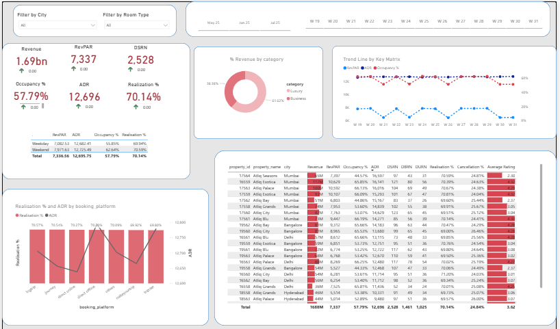

# 🏨 Hotel Performance Dashboard - Power BI

This repository contains a Power BI dashboard developed to analyze and visualize key performance metrics for a multi-property hotel chain. It enables stakeholders to gain deep insights into revenue performance, room utilization, platform effectiveness, and overall operational efficiency.

---

## 📊 Dashboard Overview

The dashboard provides an interactive and visual representation of the following key areas:

- **Revenue Analysis**  
  Total revenue, RevPAR, ADR, and DSBRN with week-on-week comparisons.

- **Occupancy & Realization**  
  Current occupancy %, ADR, and realization rates across all properties.

- **Trend Analysis**  
  Week-wise trend lines for occupancy rate and realization %.

- **Revenue by Category**  
  Comparison between business and leisure categories.

- **Platform Performance**  
  Realization % and ADR breakdown by booking platforms.

- **Property-Level Metrics**  
  Granular view of each property showing:
  - Revenue
  - Occupancy %
  - ADR
  - Cancellation %
  - Average guest rating

- **Dynamic Filters**  
  Slice data by:
  - City
  - Room type
  - Date range

---

## 📌 Insights Enabled

- Identify top-performing cities and properties
- Compare revenue trends across booking platforms
- Evaluate ADR and realization trends over time
- Understand cancellation impact and guest satisfaction

---

## 🛠 Tools & Technologies

- **Power BI Desktop** for dashboard development
- **DAX (Data Analysis Expressions)** for metrics calculation
- **Data Transformation** using Power Query Editor

---

## 📷 Dashboard Preview

---
**
